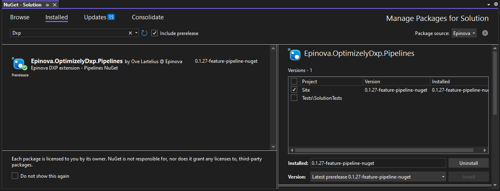
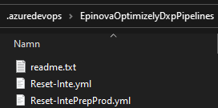

# Usage/Installation
1. Add Epinova NuGet feed to your project/solution and you will be able to install 'Epinova.OptimizelyDxp.Pipelines' NuGet package from the feed.  
Epinova NuGet feed: https://nuget.epinova.no/nuget/  

2. When you have installed the lastest NuGet. You need to build the project/solution for the NuGet content files to be copied to the '$(SolutionDir)\.azuredevops\EpinovaOptimizelyDxpPipelines'.  
  
3. Make sure that you commit/checkin these new files and updates that you want to add to the solution. The files need to exist in the solution to be able to point them out and use them in Azure DevOps.  

[Back...](readme.md)  
