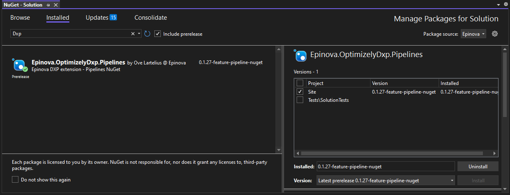

# Epinova.OptimizelyDxp.Pipelines
NuGet with YML pipelines that can be used in projects to setup pipelines for deployment to DXP fast and easy. 

## Usage/Installation
Add Epinova NuGet feed to your project/solution and you will be able to install 'Epinova.OptimizelyDxp.Pipelines' NuGet package from the feed.  
Epinova NuGet feed: https://nuget.epinova.no/nuget/  
  

When you have installed the lastest NuGet. You need to build the project/solution for the NuGet content files to be copied to the '$(SolutionDir)\DxpPipelines'.  

## Pipelines
### Reset-IntePrepProd.yml
Used when there is a environment that has for some reason stoped during deployment. If you need to reset you can run this pipeline.  
It will start to look at the Integration environment and ask if the environmnet is in a state that can be reset. If so it will be reseted. If not it will go to 'Preproduction' and repeat. And in the end the same for the 'Production' environment. 

### Reset-Inte.yml
Used when there is a environment that has for some reason stoped during deployment. If you need to reset the 'Integration' environment you can run this pipeline.  

## Prerequisites/Preparation
### Create variable group
All tasks and YAML files are using variables that can be reused by one to many pipelines. In Azure DevOps you can use a variable group for this use case.  
[How to create variable group in Azure DevOps](../documentation/CreateVariableGroup.md)  
