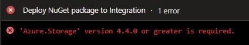

# Epinova DXP Deployment
Bucket of release tasks helping you to deploy to all environments in Optimizely (formerly known as Episerver) DXP (a.k.a DXC) from Azure DevOps. The release tasks use the [Deployment API](https://world.episerver.com/digital-experience-cloud-service/deploying/episerver-digital-experience-cloud-deployment-api/). There are some developers out there that want/need help with deployment to the Optimizely (formerly known as Episerver) DXP enviroment. And that is why this deployment extension is created. 

## Install 
[How to install Epinova DXP Deployment extension](documentation/InstallDxpExtension.md)  
**In short:**
Install the extension to your Azure DevOps project: [https://marketplace.visualstudio.com/items?itemName=epinova-sweden.epinova-dxp-deploy-extension](https://marketplace.visualstudio.com/items?itemName=epinova-sweden.epinova-dxp-deploy-extension). Click on the green "Get it free" button and follow the instructions.  
Microsoft has general information on how to install an Azure DevOps extension:  [https://docs.microsoft.com/en-us/azure/devops/marketplace/install-extension](https://docs.microsoft.com/en-us/azure/devops/marketplace/install-extension)  
In the end of that page, there also a link to how to manage extension permission. [https://docs.microsoft.com/en-us/azure/devops/marketplace/how-to/grant-permissions](https://docs.microsoft.com/en-us/azure/devops/marketplace/how-to/grant-permissions)  

## Azure.Storage v4.4.0 or greater is required.
If you experience the error 'Azure.Storage' v4.4.0 or greater is required.  
[How to solve the Azure.Storage v4.4.0 error](documentation/AzureStorage440Error.md)  

## Tasks ##

### Deploy NuGet package (Optimizely DXP) ###  
Take a NuGet package from your drop folder in Azure DevOps and upload it to your Optimizely (formerly known as Episerver) DXP project and start a deployment to the specified environment.  
[Deploy NuGet package documentation](documentation/DeployNugetPackage.md)  
  
### Deploy To (Optimizely DXP) ###
Do the same thing like the "Deploy to =>" button in the portal. It moves the deployed code from one environment to another.  
Can also be used for Content copy during deployment. With the IncludeBlob and IncludeDb you can now sync/deploy both ways.  
Also support Zero Downtime Deployment (aka ZDD or Smooth deployment).  
[Deploy to documentation](documentation/DeployTo.md)  

### Deploy Smooth To (Optimizely DXP) ###
Deprecated! You should stop using this task DeploySmoothTo. You should change to DeployTo.
Do the same thing as the "Deploy to" task. But this has support for Smooth deployment (Zero downtime deployment).  
Since this function is still in [closed beta](https://world.episerver.com/service-and-product-lifecycles/#CloudServicesLifecycle). There is not everybody that can use this feature yet. That is why this is like a copy past of the "Deploy To" task but with smooth deployment support.  
When this feature is public for all DXP users, we will implement this feature on the "Deploy to" task.  
[Deploy smooth to documentation](documentation/DeploySmoothTo.md)  

### Content copy (Optimizely DXP) ###
Copy content database and/or blobs between your environments.  
[Content copy documentation](documentation/ContentCopy.md)  
[Example how to use Content copy](documentation/ContentHarmonization.md)  

### Complete deploy (Optimizely DXP) ###
Both "Deploy nuget package (Optimizely DXP)" and "Move deploy (Optimizely DXP)" tasks deploy a package to a environment. That will deploy the package to a slot. The task "Complete deploy (Optimizely DXP)" will complete the deploy and move the packe from slot to the real environment.  
[Complete deploy documentation](documentation/CompleteDeploy.md)

### Smoke test if fail reset (Optimizely DXP) ###
This task smoke test a slot and decide if we should continue the release or reset the environment slot because something is not working as expected. The smoke test is a simple check if one or many specified URLs returns HTTPStatus = 200 (OK).  
[Smoke test if fail reset documentation](documentation/SmokeTestIfFailReset.md)

### Reset deploy (Optimizely DXP) ###
Reset a specifed environment if the status for the environment is in status "AwaitingVerification".  
[Reset deploy documentation](documentation/ResetDeploy.md)

### Export DB (Optimizely DXP) ###
Export database as a bacpac file from specified environment.  
[Export DB documentation](documentation/ExportDb.md)  

### Await status (Optimizely DXP) ###
Task that await for status AwaitingVerification/Reset. Can be used when have a release setup that often timeout and need a extra task that verify correct status. If status is AwaitingVerification/Reset/Succeeded, nothing will happen.  
[Await status documentation](documentation/AwaitStatus.md)  

### Expect status (Optimizely DXP) ###
Task that check the status for an environment. if environment is not in the expected status the task will fail.  
[Expect status documentation](documentation/ExpectStatus.md)  

## Setup scenarios ##
More detailed description how you can setup and use these tasks in different scenarios. Both with YAML and manual setup.  
[Setup senarios](documentation/SetupScenarios.md)  
[Example how to setup content harmonization between DXP environments](documentation/ContentHarmonization.md)
  
## Problems ##
A collection of problems that has been found and how to fix it.  
[Problems](documentation/Problems.md)

## Release notes ##
[Release notes](src/ReleaseNotes.md)