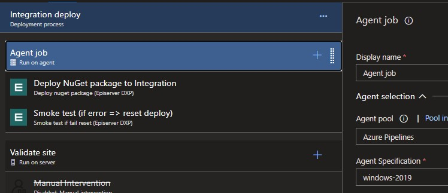

## Azure.Storage v4.4.0 or greater is required. - Error
If you experience the error 'Azure.Storage' v4.4.0 or greater is required.  
You need to use a newer Agent Specification in Azure DevOps. You should use `windows-2019`. The error is raised if you use `vs2017-win2016`.  
   

[<= Back](../README.md)
