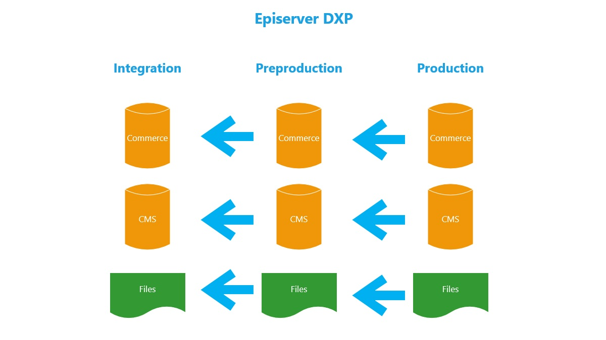
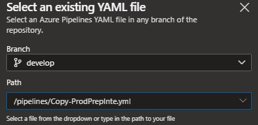
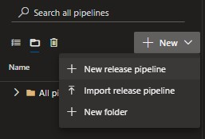
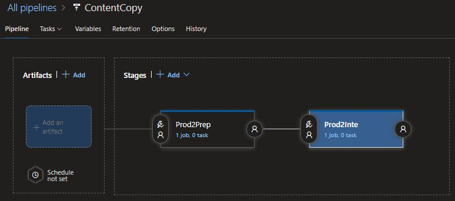
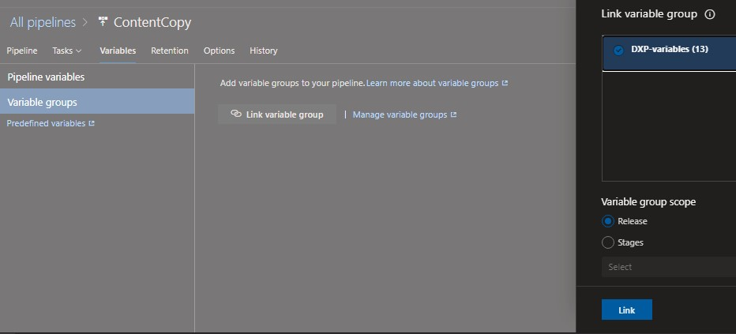
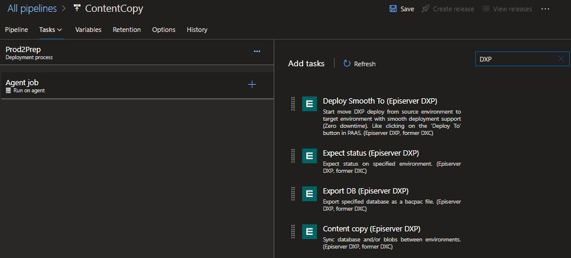
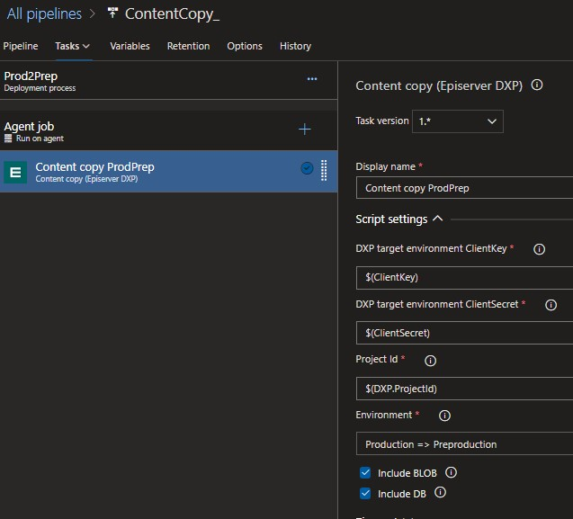
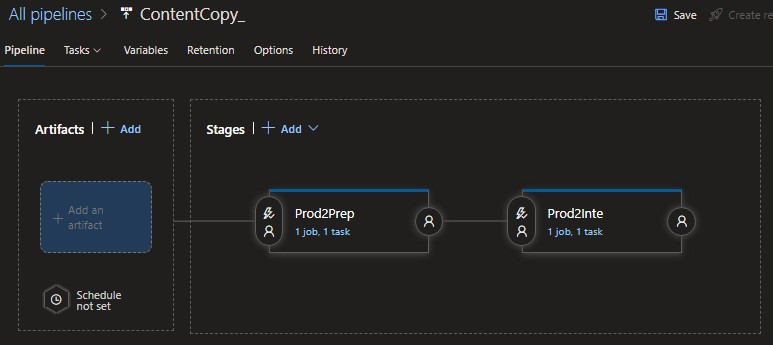
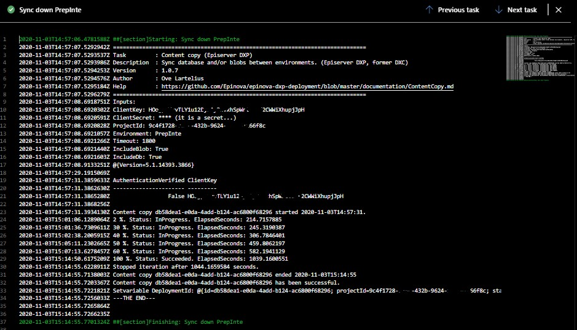

# Optimizely (formerly known as Episerver) DXP content harmonization with Epinova Optimizely DXP deployment #
**Harmonize content between Optimizely (formerly known as Episerver) DXP environments from Azure DevOps with Epinova Optimizely DXP Deployment Extension. Without using a single line of PowerShell.**  

## What is Epinova Optimizely DXP deployment extension? ##
Epinova Optimizely DXP deployment extension contains Azure DevOps tasks that abstract the interaction with the Optimizely (formerly known as Episerver) DXP deployment API. Shortly we can say that with Epinova Optimizely DXP deployment tasks enables you to use the functionality in the Optimizely (formerly known as Episerver) DXP deployment API without having to write any PowerShell.  

## How to harmonize content between Optimizely (formerly known as Episerver) DXP environments in Azure DevOps? ##
There are two ways that you can set this up. Either you like to use YAML to create a pipeline that copy your content or you like to setup a release pipeline in classic mode. Both ways are supported.  
It as simple as just using the task “**Content copy**” to solve this.

## Prerequisites ##
If you are already using Epinova Optimizely DXP deployment extension there is a good possibility that you have already done this. But you need to have the following steps setup.  

### Install Epinova Optimizely DXP deployment extension to you Azure DevOps organization ###
Instructions how to install the extension and be able to use the tasks can be found in the documentation. [Install Epinova Optimizely DXP Deployment extension](InstallDxpExtension.md)  

### DXP variable group ###
Either you choose the YAML or classic road you need to make sure that you have created a “Variable group” with your project specific variables. You can follow the instructions in the documentation how to create variable group and how to gather the variable information needed. [How to setup variable group](CreateVariableGroup.md)

## Content copy with YAML ##
There are 4 example YAML files in the documentation that can be downloaded and used from the GitHub repository.  
The 1:st example, “Copy-PrepInte.yml”, can be used out of the box if you want to copy content (DB and blobs) from preproduction to integration environment.  
The 2:nd example, “Copy-ProdInte.yml”, can be used out of the box if you want to copy content (DB and blobs) from production to integration environment.  
The 3:rd example, “Copy-ProdPrep.yml”, can be used out of the box if you want to copy content (DB and blobs) from production to preproduction environment.  
The 4:th example, “Copy-ProdPrepInte.yml”, can be used out of the box if you want to copy content (DB and blobs) from production to preproduction and to integration environment.  

You can find ready to use examples here
[Copy-PrepInte.yml](../Pipelines/Copy-PrepInte.yml)  
[Copy-ProdInte.yml](../Pipelines/Copy-ProdInte.yml)  
[Copy-ProdPrep.yml](../Pipelines/Copy-ProdPrep.yml)  
[Copy-ProdPrepInte.yml](../Pipelines/Copy-ProdPrepInte.yml)  
([See all YAML example pipelines](../Pipelines))  
There is no automatic trigger on these pipelines and they should be started manually when needed.  
### How to add a YAML pipeline ###
1.	Download one of the example YAML files from GitHub or create your own YAML file. In this example I have a “pipeline” folder in the root of the project where I place the YAML pipelines.
2.	Check in/Commit and push your added YAML file to your code repository.
3.	In Azure DevOps, go to the Pipeline list page and click on “New pipeline”.
4.	Select the type of your repository.
5.	Select the repository. (This could be little different depending on which repository type you are using.)
6.	When you get to the step to choose “pipeline”. Select “Existing Azure Pipelines YAML file”.  
  
7.	Select the YAML file you have added before. Azure DevOps have scanned your folders and will present all the YAML files that it can find in your source code.  
  
8.	You should now be able to see the YAML code and can rename the pipeline and/or start the pipeline.

## Content copy - classic mode ##
It does not matter if you have YAML files for deployment or not. Sometimes it is much simpler to have some pipelines in classic mode. 
1.	Create a new release pipeline in you project.  
  
2.	Select “Empty job” and give the pipeline a good name.
3.	Name the first stage. Example: “Prod2Prep”
4.	Create another stage and name it. Example: “Prod2Inte”  
  
5.	Before we add tasks to the stages we should link the release pipeline to the variable group with our variables that we can reuse. Click the “Variables” tab and select the “Variable groups”. Click “Link variable group” and select your variable group that you created earlier.  
  
6.	Go back to the first stage. Now it is time to start add the tasks.
7.	Click the plus sign/icon and search for DXP in the search field. All Epinova Optimizely DXP deployment tasks will be shown and you should add the “Content copy” task.  
  
8.	Now just specify the “Environment”, “Include BLOB” and “Include DB”.  
  
9.	Now you can do the same thing for the “Prod2Inte” stage. But make sure that you set “Environment” = Production => Integration.  
  
  

You are done. You can now run the release pipeline and harmonize the content for your DXP website from production => preproduction and production => integration. After you run the content copy you can see in the log what the task has done. This is a example of that:  
  
It is also possible to configure the stages to have post and/or pre-approvals. Or add a scheduler that trigger the release pipeline reoccurring. It is all up to you and your project.

  
[<= Back](../README.md)

