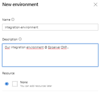
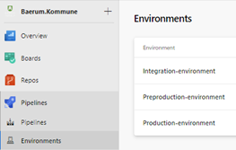
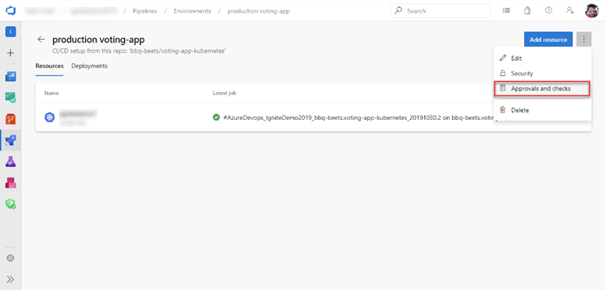

# Environments
When you are using YAML to create pipelines and want/need approval steps before deployment to next environment. You must have “environments” registered in Azure DevOps.

[<= Back to scenarios](SetupScenarios.md)

## Create environments
In the Pipelines menu in Azure DevOps you should have a menu item with the name "Environments". Click on that and find the "New environment".  
  
Create 3 environments:  
* `Integration-environment`
* `Preproduction-environment`
* `Production-environment`  
**Note**: *If you create the environments with these names. You don´t need to change any parameters in the YAML files.*  

When you create an environment, you can use “None” as resource. We will use "None" because we don´t have any real resources behind. This is the only way to add approval to YAML pipelines at present time. I know that many have requested better features from Microsoft regarding YAML. So this could be changed in the future.  
  
### Result
When you have created the environments, the list should like something like this:  
  

### Source: 
[https://docs.microsoft.com/en-us/azure/devops/pipelines/process/environments?view=azure-devops#creation](https://docs.microsoft.com/en-us/azure/devops/pipelines/process/environments?view=azure-devops#creation)

## Set approval
To make sure that you get a change to approve a deployment before a deploy starts automatically and just deploy to production. We need to add approval on environment where you want to add this security. And you should at least add approval to the production environment. Otherwise the pipeline will deploy to production without your approval.  
We recommend that you add approval to the preproduction and production environment.  
To define an approval on an environment:  
1.	In your Azure DevOps project, go to the environment that needs to be protected.
2.	Navigate to Approvals and Checks for the environment.   
3.	Select Create, provide the approvers and an optional message, and select Create again to complete addition of the manual approval check.  
  
You can add multiple approvers to an environment. These approvers can be individual users or groups of users. When a group is specified as an approver, only one of the users in that group needs to approve for the run to move forward. Using the advanced options, you can configure if a subset of approvals is enough or if you need all the specified users to complete the approval. You can also restrict the user who requested (initiated or created) the run from completing the approval. This option is commonly used for segregation of roles amongst the users.  

When you run a pipeline, the execution of that run pauses before entering a stage that uses the environment. Users configured as approvers must review and approve or reject the deployment. If you have multiple runs executing simultaneously, you must approve or reject each of them independently. If all required approvals are not complete within the Timeout specified for the approval, the stage is marked failed.
### Source: 
[https://docs.microsoft.com/en-us/azure/devops/pipelines/process/approvals?view=azure-devops&tabs=check-pass#approvals](https://docs.microsoft.com/en-us/azure/devops/pipelines/process/approvals?view=azure-devops&tabs=check-pass#approvals)

[<= Back to scenarios](SetupScenarios.md)  
[<= Back to root](../README.md)
