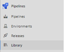
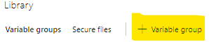
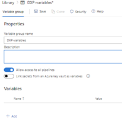
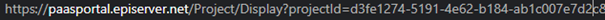
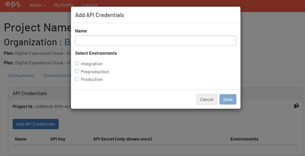
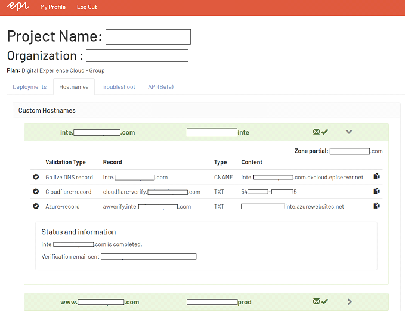
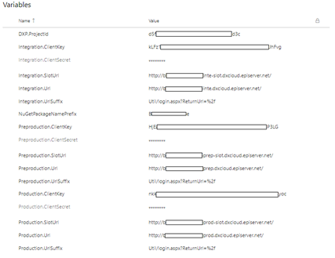

# Create variable group
All tasks and YAML files are using variables that can be reused by one to many pipelines. In Azure DevOps you can use a variable group for this use case.

[<= Back to scenarios](SetupScenarios.md)  

## Create variable group
In the menu you can find the Library.  
  
There you can create a variable group with the name “DXP-variables”.  
  
*Note: If you use the name “DXP-variables” you don’t need to change any names in the YAML-files that we will use.*  
### Variable group information
Variable group name: `DXP-variables`  
Allow access to all pipelines: `True`  
  
### Variables
The following variables need to exist.  
* DXP.ProjectId
* ClientKey
* ClientSecret (Make as password variable)
* Integration.SlotUrl
* Integration.Url
* Integration.UrlSuffix
* NuGetPackageNamePrefix
* Preproduction.SlotUrl
* Preproduction.Url
* Preproduction.UrlSuffix
* Production.SlotUrl
* Production.Url
* Production.UrlSuffix

## Gather variable information
And this is how you get the information that you provide as values to each variable.
### DXP.ProjectId
Go to https://paas.episerver.net and login. When you are on the list page for all organizations that you have access to and look at the URL. You should see that it contains the querystring “projected=xxxx”. Copy the projectId value from the URL and add as value for the variable “DXP.ProjectId”.  
  

### ClientKey, ClientSecret
Go back to https://paas.episerver.net and click on the link to the project that you setup the deploy for. On the project page you should click on the tab “API (Beta)”. Click on the “Add API Credentials” and give it a name. Select all environments (Integration, Preproduction, Production). After clicked save you will receive a ClientKey and ClientSecret that you can copy to your variables.
  

### SlotUrl, Url
When you do a deploy to an environment in Episerver DXC the package will be deployed to a slot. That slot can be verified by you and/or the customer. If everything looks ok and your verification tests passes, the package can be deployed to the environment. The SlotUrl variable is the URL to the slot during deployment. And the URL is the URL to the environment that you deploy to.  
**Example:**  
SlotUrl: `https://epinova012prod-slot.dxcloud.episerver.net/`  
Url: `https://www.epinova.com/`  

When the project where ordered from Episerver we got the URL to the integration invironment: `epinova012inte.dxcloud.episerver.net`. And there is a simple pattern that we can use to figure out the rest of all URLs. So from the information a got from Episerver these is our URLS:  
Integration-slot:   `http://epinova012inte-slot.dxcloud.episerver.net`  
Integration:        `http://epinova012inte.dxcloud.episerver.net`  
Preproduction-slot: `http://epinova012prep-slot.dxcloud.episerver.net`  
Preproduction:      `http://epinova012prep.dxcloud.episerver.net`  
Production-slot:    `http://epinova012prod-slot.dxcloud.episerver.net`  
Production:         `http://epinova012prod.dxcloud.episerver.net`  
So from that first URL you can see that our project URL name is `epinova012`. And it always end with `.dxcloud.episerver.net`. Slots use `-slot`. And then we have the environments Integration = `inte`, Preproduction = `prep` and Production = `prod`. So now it is a little bit simplier to lay the puzzle.  
  
Later during the development you will order/change hostnames. Then these values in the variable group should be updated. In my example above we did not use HTTPS. That is also one thing that could change during development.

There is also a hostname tab in the paas portal that could help you with some information.  
To get these URLs you go back to https://paas.episerver.net. And select the project that you setup the deploy for. On the project page you should click on the tab “Hostnames”. 
  
 
### UrlSuffix
The URL suffix are used by the test step when a request will be done against the deployed environment with example [Integration.SlotUrl] + [Integration.UrlSuffix]. Example: https://epinova012inte-slot.dxcloud.episerver.net/Util/login.aspx?ReturnUrl=%2f  
So, you can use this suffix to request your site even if you have turned off the anonymous access to the site.  

### NuGetPackageNamePrefix
The prefix for the NuGet package name.  
Example: If the value is “MyProject.Website” the NuGet package will get the name “MyProject.Website.cms.app.20200414.1.nupkg”.  

## Result
When all the variables in the group has been set you can save the variable group.
When you are done it should look something like this.
  

[<= Back to scenarios](SetupScenarios.md)  
[<= Back to root](../README.md)
