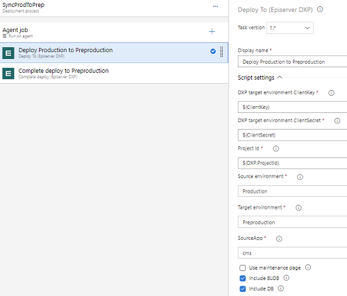

# Deploy to (Episerver DXP) #
Do the same thing like the "Deploy to =>" button in the portal. It moves the deployed code from one environment to another.  
Have support for IncludeBlob and IncludeDb so that you can deploy your code and move BLOBs and/or DBif you want.  
Can also be used for Content syncdown. Example: if you want to make your preproduction environment contain the same content as in production. [More about content syncdown can be read on Episerver world.](https://world.episerver.com/blogs/anders-wahlqvist/dates/2020/4/dxp-deployment-improvements/)  
_*NOTE 2020-09-30:* At present date the sync can not handle just one database type. It will sync both cms AND commerce database. We tried to just sync the cms database but there is no support for that in the Episerver API. So if you have a cms and commerce database, both databases will sync when if you set SourceApp=cms._  
  
[<= Back](../README.md)

## Parameters
### Group: Settings
#### DXP target environment ClientKey
**[string]** - **required**  
The DXP API ClientKey for the current environment.  
**Example:** `mRgLgE3uCx7RVHc5gzFu1gWtssxcYraL0CvLCMJblkbxweO9`  
**Default value:** `$(ClientKey)`

#### DXP target environment ClientSecret
**[string]** - **required**  
The DXP API ClientSecret for the current environment.  
**Example:** `mRgLgE3uCx7RVHc5gzFu1gWtssxcYraL0CvLCMJblkbxweO9mRgLgE3uCx7RVHc5gzFu1gWtssxcYraL0CvLCMJblkbxweO9mRgLgE3uCx7RVHc5gzFu1gWtssxcYraL0CvLCMJblkbxweO9`  
**Default value:** `$(ClientSecret)`

#### Project Id
**[string]** - **required**  
The DXP project id.  
**Example:** `1921827e-2eca-2fb3-8015-a89f016bacc5`  
**Default value:** `$(DXP.ProjectId)`

#### Source environment
**[pickList]** - **required**  
Specify from which environment you want to take the source code/package.  
**Example:** `Integration`  
**Default value:** `$(SourceEnvironment)`  
**Options:**  
- Integration
- Preproduction
- Production

#### Target environment
**[pickList]** - **required**  
Specify if you want to deploy to Integration/Preproduction/Production.  
**Example:** `Integration`  
**Default value:** `$(TargetEnvironment)`  
**Options:**  
- Integration
- Preproduction
- Production

#### SourceApp
**[pickList]** - **required**  
Specify which type of application you want to move. (When use syncdown, this param has no effect. Will sync all databases.) 
**Example:** `commerce`  
**Default value:** `cms`  
**Options:**  
- cms
- commerce
- cms,commerce

#### Use maintenance page
**[boolean]** - **required**  
Specify if you want to use a maintenance page during the deploy.  
**Example:** `true`  
**Default value:** `false`

#### Include BLOB
**[boolean]** - **required**  
If BLOBs should be copied from source environment to the target environment.  
**Example:** `true`  
**Default value:** `false`

#### Include DB
**[boolean]** - **required**  
If DBs should be copied from source environment to the target environment.  
**Example:** `true`  
**Default value:** `false`

### Group: Timeout
#### Script timeout (in seconds)
**[int]** - **required**  
Specify the number of seconds when the task should timeout.  
**Example:** `600`  
**Default value:** `1800` (30 minutes)

### Group: ErrorHandlingOptions
#### ErrorActionPreference
**[pickList]** - **required**  
How the task should handle errors.  
**Example:** `600`  
**Default value:** `stop`
**Options:**  
- **Stop**: Terminate the action with error.
- **Continue**: Display any error message and attempt to continue execution of subsequence commands.
- **SilentlyContinue**: Don't display an error message continue to execute subsequent commands.

## YAML ##
Example:  
```yaml
- task: DxpDeployTo@1
inputs:
    ClientKey: '$(ClientKey)'
    ClientSecret: '$(ClientSecret)'
    ProjectId: '$(DXP.ProjectId)'
    SourceEnvironment: 'Preproduction'
    TargetEnvironment: 'Production'
    SourceApp: 'cms'
    UseMaintenancePage: false
    Timeout: 1800
```
## Example of content syncdown from Production to Preproduction
  

[<= Back](../README.md)
