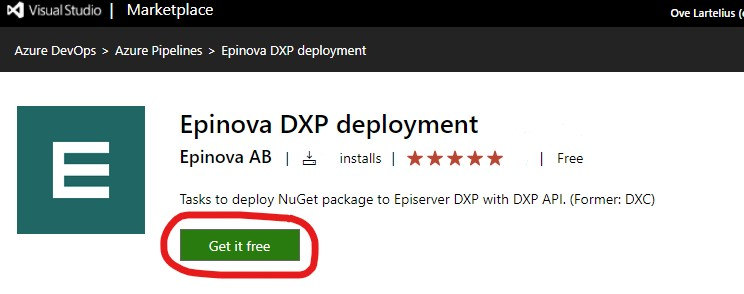

# Install Epinova DXP deployment extension  

1. Install the extension to your Azure DevOps project: [https://marketplace.visualstudio.com/items?itemName=epinova-sweden.epinova-dxp-deploy-extension](https://marketplace.visualstudio.com/items?itemName=epinova-sweden.epinova-dxp-deploy-extension).  
Click on the green "Get it free" button and follow the instructions.  

2. Select the Azure DevOps organization that you have access to and want to install the Epinova DXP deployment extension to. If you have on-premise Azure DevOps. You can download the extension so that you install it.  
  
Microsoft has general information on how to install an Azure DevOps extension:  [https://docs.microsoft.com/en-us/azure/devops/marketplace/install-extension](https://docs.microsoft.com/en-us/azure/devops/marketplace/install-extension)  
In the end of that page, there also a link to how to manage extension permission. [https://docs.microsoft.com/en-us/azure/devops/marketplace/how-to/grant-permissions](https://docs.microsogft.com/en-us/azure/devops/marketplace/how-to/grant-permissions)  

[Setup senarios](SetupScenarios.md) 
  
[<= Back](../README.md)

